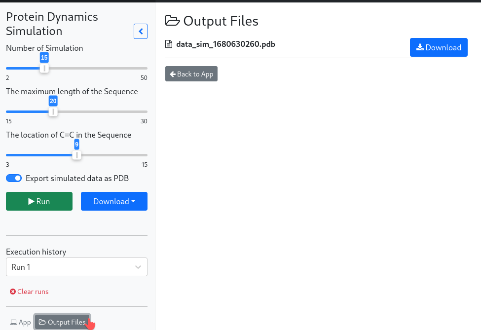
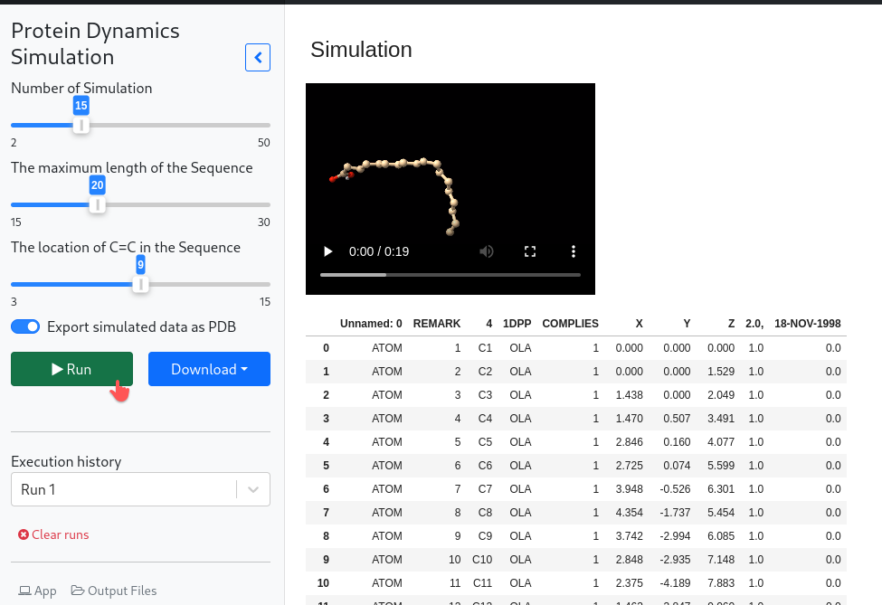
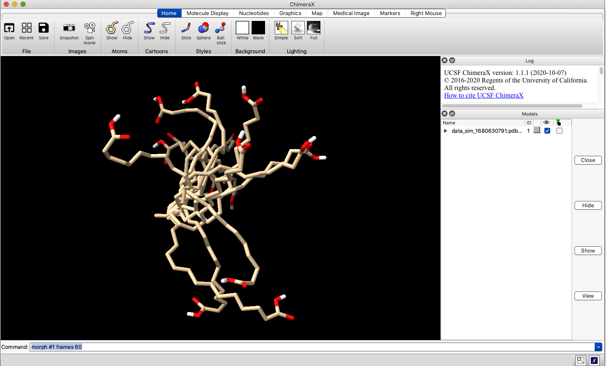

# protein-dynamics-sim
## Run simulation

## Download simulated PDB file

## Open PDB with [ChimeraX](https://www.cgl.ucsf.edu/chimerax/download.html)

## Creates a trajectory using `morph` command
* For example:
```
morph #1 frames 60
```

